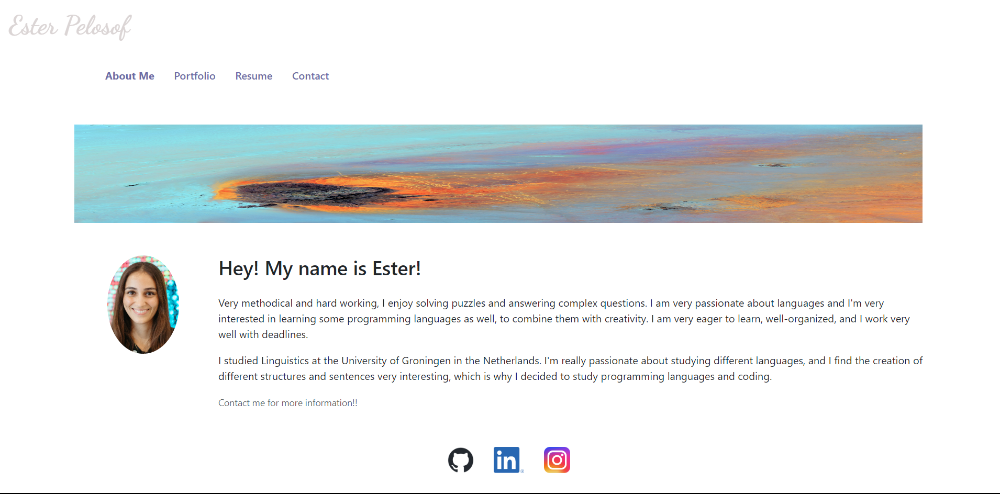

# React Portfolio

## Table of Contents

- [Description](#description)
- [Installation](#installation)
- [Usage](#usage)
- [Questions](#questions)

### Description

This is my portfolio created with `React. I used this technology to showcase my knowledge of creating a single-page application, which would allow me to display my past projects. Other technologies used are `CSS`, `React Bootstrap`, as well as several other `React` libraries. Finally, this application is fully responsive and follows accessibility standards.

- Follow the link to access the live version of my Portfolio: https://efp18.github.io/React-Portfolio/

- GitHub repository: https://github.com/EFP18/React-Portfolio

### Installation

Follow the steps below to install the application:

- Clone the repository to your local machine.
- Navigate to the cloned repository locally.
- Run `npm i` to install all necessary dependencies.
- Run `npm start` to start the application.

  Your browser will automatically open once the repository is compiled successfully, and it will open on `http://localhost:3000/`.

  This application is deployed using `GitHub Pages`.

### Usage

This repository is a portfolio of my work. You will find it being divided in 4 different sections, namely `About Me`, `Portfolio`, `Resume` and `Contact`. Each page provides different information about me. Since this application doesn't have a backend, the `Contact form` won't submit your information at the moment, but that functionality will be added shortly so that I can receive your messages directly through it.

In addition, you will be able to see my past deployed projects, as well as videos of backend projects that haven't been deployed, and I also provide the GitHub links to all of my projects, in case you want to see the code behind each one.

Lastly, you can download my complete resume through the `Resume` tab.

### Questions

- GitHub: https://github.com/EFP18
- Email: ester.p18@hotmail.com
